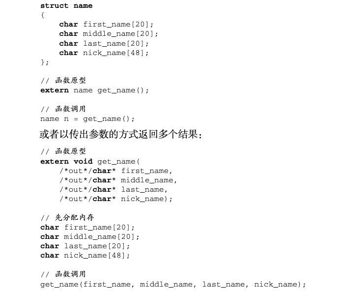

## 1 综述


## 2 特性

### 2.1 自动垃圾回收

对内存泄漏最佳解决方案是在语言级别引入自动垃圾回收算法，所有的内存分配动作都会被在运行时记录，同时任何对该内存的使用也都会被记录，然后垃圾回收器会对所有已分配的内存进行跟踪监测，阶段性的回收不再被使用的内存。

### 2.2 更丰富的内置类型

相比c语言，不需要在再手动倒入一些基本库

内置了map类型和数组切片slice类型

### 2.3 函数多返回值

目前的主流语言中除Python外基本都不支持函数的多返回值功能

不支持多返回值类型的语言在一个函数中需要返回多个类型，通常需要定义一个结构体或者以传出多个参数的方式返回结果



Go语言中上面的例子可以被修改为

```go
func getName()(firstName, middleName, lastName, nickName string){ 
  return "May", "M", "Chen", "Babe"
}
func getName()(firstName, middleName, lastName, nickName string){ 
		firstName = "May"
		middleName = "M"
		lastName = "Chen"
		nickName = "Babe"
		return
}
如果开发者只对该函数其中的某几个返回值感兴趣的话，也可以直接用下划线作为占位符来 忽略其他不关心的返回值。下面的调用表示调用者只希望接收lastName的值，这样可以避免声 明完全没用的变量:
_, _, lastName, _ := getName()
```

### 2.4 错误处理

Go语言引入了3个关键字用于标准的错误处理流程，这3个关键字分别为defer、panic和 recover

比如使用defer语句可以更加简单的避免java等语言中try-catch的嵌套

```java
Connection conn = ...;
try {
		Statement stmt = ...; 
  	try {
				ResultSet rset = ...; 
      	try {
		... // 正常代码 
        }
				finally { 
          rset.close();
				} 
    }
		finally { 
      stmt.close();
		} 
}
finally { 
  	conn.close();
}
```

```go
conn := ...
defer conn.Close() stmt := ...
defer stmt.Close()
rset := ...
defer rset.Close() ... // 正常代码
```

### 2.5 匿名函数和闭包

在Go语言中，==所有的函数也是值类型，可以作为参数传递==。Go语言支持常规的匿名函数和 闭包，比如下列代码就定义了一个名为f的匿名函数，开发者可以随意对该匿名函数变量进行传 递和调用:

```go
f := func(x, y int) int { return x + y
}
```

### 2.6 类型和接口

Go语言的类型定义非常接近于C语言中的结构(struct)，甚至直接沿用了struct关键字。相 比而言，Go语言并没有直接沿袭C++和Java的传统去设计一个超级复杂的类型系统，==不支持继承和重载==，而只是支持了最基本的类型组合功能。

C语言和java在实现一个接口之前必须定义该接口，并且将类型和接口紧密绑定。

Go语言例子如下：

```go
type Bird struct { ...
}
func (b *Bird) Fly() { // 以鸟的方式飞行
}
我们在实现Bird类型时完全没有任何IFly的信息。我们可以在另外一个地方定义这个IFly
接口:
type IFly interface { 
  Fly()
}
  这两者目前看起来完全没有关系，现在看看我们如何使用它们:
func main() {
var fly IFly = new(Bird) //该接口是应用给Bird这个struct的 
  fly.Fly()
}
```

### 2.7 并发编程

Go语言引入了goroutine概念，它使得并发编程变得非常简单。通过使用goroutine而不是裸用 操作系统的并发机制，以及使用消息传递来共享内存而不是使用共享内存来通信，Go语言让并发编程变得更加轻盈和安全。

**执行体间的通信，包含几个方式：**

- 执行体之间的互斥与同步

  先说“执行体之间的互斥与同步”。当执行体之间存在共享资源(一般是共享内存)时，为 保证内存访问逻辑的确定性，需要对访问该共享资源的相关执行体进行互斥。当多个执行体之间 的逻辑存在时序上的依赖时，也往往需要在执行体之间进行同步。互斥与同步是执行体间最基础 的交互方式。

- 执行体之间的消息传递

  在并发编程模型的选择上，有两个流派，**一个是共享内存 模型，一个是消息传递模型。**

  Go语言采用消息传递你想，但是仍然保持着共享内存模型，通过channel实现，两个goroutine之间可以通过通道来进行交互。

