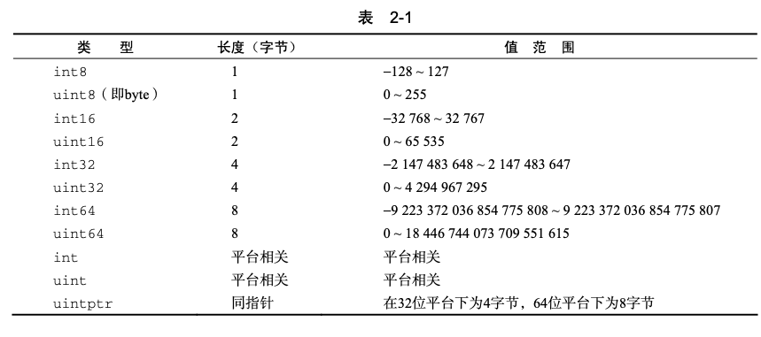
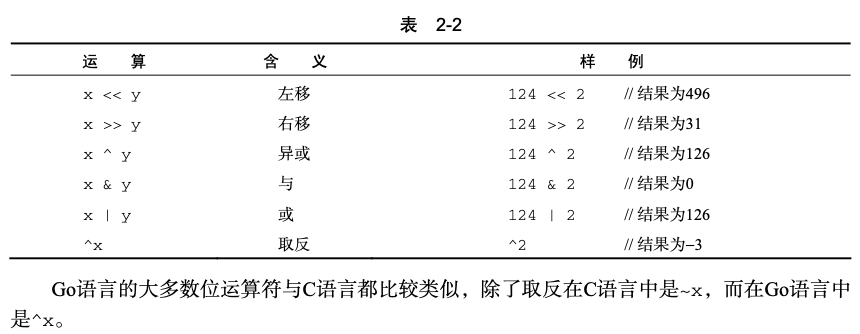
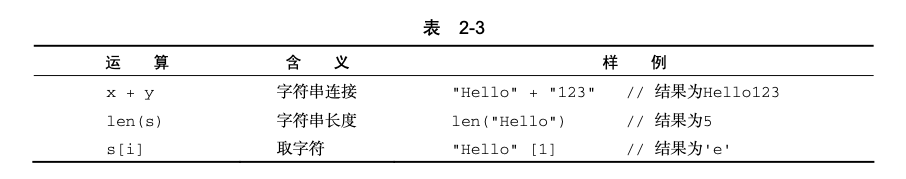

## 1 变量

### 1.1 变量声明

go语言引入关键字var，类型信息放在变量名之后

```go
var v1 int
var v2 string
var v3 [10]int   //数组
var v4 []int     //数组切片，动态数组
var v5 struct {
  	f int
}
var v6 *int
var v7 map[string]int
var v8 func(a int) int
```

多个变量放置在一起

```go
var (
		v1 int
		v2 string
)
```

### 1.2 变量初始化

```
var v1 int = 10
var v2 = 10
v3 := 10
```

以上三种用法的效果是完全一样的。与第一种用法相比，第三种用法需要输入的字符数大大 减少，是懒程序员和聪明程序员的最佳选择

### 1.3 变量赋值

在Go语法中，变量初始化和变量赋值是两个不同的概念。下面为声明一个变量之后的赋值过程：

`var v10 int v10 = 123`

Go语言的变量赋值与多数语言一致，但Go语言中提供了C/C++程序员期盼多年的多重赋值功 能，比如下面这个交换i和j变量的语句:

`i, j = j, i`

### 1.4 匿名变量

我们在使用传统的强类型语言编程时，经常会出现这种情况，即在调用函数时为了获取一个 值，却因为该函数返回多个值而不得不定义一堆没用的变量。在Go中这种情况可以通过结合使 用多重返回和匿名变量来避免这种丑陋的写法，让代码看起来更加优雅。

假设GetName()函数的定义如下，它返回3个值，分别为firstName、lastName和 nickName:

```go
func GetName() (firstName, lastName, nickName string) { 
  return "May", "Chan", "Chibi Maruko"
}
```

 若只想获得nickName，则函数调用语句可以用如下方式编写:

```go
    _, _, nickName := GetName()
```

## 2 常量

在Go语言中，常量是指编译期间就已知且不可改变的值。常量可以是数值类型(包括整型、浮点型和复数类型)、布尔类型、字符串类型等。

### 2.1 字面常量

所谓字面常量(literal)，是指程序中硬编码的常量，如:

```go
-12
3.14159265358979323846 // 浮点类型的常量 
3.2+12i // 复数类型的常量 
true // 布尔类型的常量 
"foo" // 字符串常量
```

在其他语言中，常量通常有特定的类型，比如-12在C语言中会认为是一个int类型的常量。 如果要指定一个值为12的long类型常量，需要写成-12l，这有点违反人们的直观感觉。Go语言 的字面常量更接近我们自然语言中的常量概念，它是无类型的。只要这个常量在相应类型的值域 范围内，就可以作为该类型的常量，比如上面的常量12，它可以赋值给int、uint、int32、 int64、float32、float64、complex64、complex128等类型的变量。

### 2.2 常量定义

const关键字给常量定义名字

```go
const Pi float64 = 3.14159265358979323846
const zero = 0.0 
const (
	size int64 = 1024 
  eof = -1
)
const u, v float32 = 0, 3  // u = 0.0, v = 3.0，常量的多重赋值
const a, b, c = 3, 4, "foo" //a=3,b=4,c="foo", 无类型整型和字符串常量

```

Go的常量定义可以限定常量类型，但不是必需的。如果定义常量时没有指定类型，那么它 与字面常量一样，是无类型常量。

常量定义的右值也可以是一个在编译期运算的常量表达式，比如`const mask = 1 << 3 `由于常量的赋值是一个编译期行为，所以右值不能出现任何需要运行期才能得出结果的表达式，比如试图以如下方式定义常量就会导致编译错误:

`const Home = os.GetEnv("HOME") `

原因很简单，os.GetEnv()只有在运行期才能知道返回结果，在编译期并不能确定，所以无法作为常量定义的右值。

### 2.3 预定义常量

Go语言预定义了这些常量:true、false和iota。

iota比较特殊，可以被认为是一个可被编译器修改的常量，**在每一个const关键字出现时被重置为0**，然后在下一个const出现之前，每出现一次iota，其所代表的数字会自动增1。

```go
const (
    c0 = iota   //iota=0
    c1 = iota   // 1
    c2 = iota   // 2
)
const (
    a = 1 << iota  //iota=0 a=1
    b = 1 << iota  //iota=1 a=2
    c = 1 << iota  //iota=2 a=4
)
```

如果两个const的赋值语句的表达式是一样的，那么可以省略后一个赋值表达式。因此，上面的前两个const语句可简写为:

```go
const (
   c0 = iota
   c1 
   c2
)
const (
   a = 1 << iota
   b
   c
)
```

### 2.4 枚举

​		枚举指一系列相关的常量，比如下面关于一个星期中每天的定义。通过上一节的例子，我们 看到可以用在const后跟一对圆括号的方式定义一组常量，这种定义法在Go语言中通常用于定义 枚举值。Go语言并不支持众多其他语言明确支持的enum关键字。

​		下面是一个常规的枚举表示法，其中定义了一系列整型常量:

```go
const (
		Sunday = iota
    Monday
    Tuesday
    Wednesday
    Thursday
    Friday
    Saturday
    numberOfDays  // 这个常量没有导出
)
 
```

同Go语言的其他符号(symbol)一样，以大写字母开头的常量在包外可见。

以上例子中`numberOfDays`为包内私有，其他符号则可被其他包访问。

## 3 类型

Go语言内置以下这些基础类型:

- 布尔类型:bool。
- 整型:int8、byte、int16、int、uint、uintptr等。 
- 浮点类型:float32、float64。
- 复数类型:complex64、complex128。
- 字符串:string。
- 字符类型:rune。
- 错误类型:error。

此外，Go语言也支持以下这些复合类型: 

- 指针(pointer)
- 数组(array)
- 切片(slice)
- 字典(map)
- 通道(chan)
- 结构体(struct)
- 接口(interface)

### 3.1 布尔类型

Go语言中的布尔类型与其他语言基本一致，关键字也为bool，可赋值为预定义的true和false示例代码如下:

```go
var v1 bool
v1 = tue
v2 := (1==2)  
```

布尔类型不能接受其他类型的赋值，不支持自动或强制的类型转换。以下的示例是一些错误 的用法，会导致编译错误

### 3.2 整型

整型是所有编程语言里最基础的数据类型。



- 类型表示

  int32和int 是两种不同的类型，编译器不会帮助做自动类型转换

  ```go
  var value2 int32
  value1 := 64  //类型默认为int
  value2 = value1  //编译错误
  ```

  可以使用强制类型转换解决问题

- 数值运算

  Go语言支持下面的常规整数运算:+、、*、/和%。加减乘除就不详细解释了，需要说下的 是，% 和在C语言中一样是求余运算，比如:

  `5%3// 结果为:2`

- 比较运算

  Go语言支持以下的几种比较运算符:>、<、==、>=、<=和!=。这一点与大多数其他语言相 同，与C语言完全一致。

  ```go
  i, j := 1, 2 if i == j {
        fmt.Println("i and j are equal.")
      }
  ```

​		两个不同类型的整型数不能直接比较，比如int8类型的数和int类型的数不能直接比较，但各种类型的整型变量都可以直接与字面常量(literal)进行比较。

-  与运算

  

### 3.3 浮点型

1. 浮点数表示

   Go语言定义了两个类型float32和float64，其中float32等价于C语言的float类型， float64等价于C语言的double类型。

   ```go
   var fvalue1 float32
   fvalue1 = 12
   fvalue2 := 12.0 // 如果不加小数点，fvalue2会被推导为整型而不是浮点型
   ```

2. 浮点数比较

   因为浮点数不是一种精确的表达方式，所以像整型那样直接用==来判断两个浮点数是否相等是不可行的，这可能会导致不稳定的结果。

   下面是一种推荐的替代方案:

   ```go
   import "math"
   // p为用户自定义的比较精度，比如0.00001 
   func IsEqual(f1, f2, p float64) bool {
   		return math.Fdim(f1, f2) < p 
   }
   ```

   

### 3.4 复数类型

1. 复数表示

   ```go
   var value1 complex64  //由2个float32构成的复数类型
   
   value1 = 3.2 +12i			
   value2 := 3.2 + 12i				 //value2是complex128类型
   value3 := complex(3.2,12)  //value3结果同 value2
   ```

2. 实部与虚部

   对于一个复数z = complex(x, y)，就可以通过Go语言内置函数real(z)获得该复数的实 部，也就是x，通过imag(z)获得该复数的虚部，也就是y。

### 3.5 字符串

在Go语言中，字符串也是一种基本类型。相比之下， C/C++语言中并不存在原生的字符串 类型，通常使用字符数组来表示，并以字符指针来传递。

```go
var str string
str = "Hello world"
ch := str[0]
```

字符串不能再初始化后被修改

1. 字符串操作

   

​	更多字符串操作参考标准库strings

2. 字符串遍历

​	Go语言支持两种方式遍历字符串

```go
str := "hello,world"
n := len(str)
for i := 0; i< n;i++ {
  ch := str[i]   //类型为byte
  fmt.Println(i,ch)
}

for i,ch := range str {
  fmt.Println(i,ch)  //ch 类型为rune
}
```

### 3.6 字符类型

在Go语言中支持两个字符类型，一个是byte(实际上是uint8的别名)，代表UTF-8字符串的单个字节的值;另一个是rune，代表单个Unicode字符。 关于rune相关的操作，可查阅Go标准库的unicode包。另外unicode/utf8包也提供了UTF8和Unicode之间的转换。

### 3.7 数组

数组是Go语言编程中最常用的数据结构之一。顾名思义，数组就是指一系列同一类型数据 的集合。数组中包含的每个数据被称为数组元素(element)，一个数组包含的元素个数被称为数 组的长度。

常规数组声明方法

```go
[32]byte      //长度为32的数组，每个元素为一个字节
[2*N] struct {x,y int32}  //复杂类型数组
[1000]*float64.    //指针数组
[3][5]int //二维数组
[2][2][2]float64  //三维数组
```

1. 元素访问

   ```go
   for i:=0;i<len(array);i++ {
     fmt.Println("Element",i,"of array is",array[i])
   }
   
   for i,v :=range array {
     fmt.Println("Element",i,"of array is",v)
   }
   ```

2. 值类型

   需要特别注意的是，在Go语言中数组是一个值类型(value type)。所有的值类型变量在赋值和作为参数传递时都将产生一次复制动作。如果将数组作为函数的参数类型，则在函数调用时该参数将发生数据复制。**因此，在函数体中无法修改传入的数组的内容，因为函数内操作的只是所传入数组的一个副本**

   ```go
   
   package main
   import "fmt"
   func modify(array [10]int) {
   		array[0] = 10 // 试图修改数组的第一个元素 fmt.Println("In modify(), array values:", array)
   }
   func main() {
   		array := [5]int{1,2,3,4,5} // 定义并初始化一个数组
   		modify(array) // 传递给一个函数，并试图在函数体内修改这个数组内容
       fmt.Println("In main(), array values:", array)
   }
   
   该程序的执行结果为:
       In modify(), array values: [10 2 3 4 5]
       In main(), array values: [1 2 3 4 5]
   ```

   从执行结果可以看出，函数modify()内操作的那个数组跟main()中传入的数组是两个不同的实 例。

### 3.8 数组切片

数组切片就像一个指向数组的指针，实际上它拥有自己的数据结构，而不仅仅是 个指针。数组切片的数据结构可以抽象为以下3个变量:

- 一个指向原生数组的指针; 
- 数组切片中的元素个数;
- 数组切片已分配的存储空间。

1. 创建数组切片

   - 基于数组

     数组切片可以基于一个已存在的数组创建。数组切片可以只使用数组的一部分元素或者整个数组来创建，甚至可以创建一个比所基于的数组还要大的数组切片。

     ```go
     package main
     import "fmt"
     
     func main() {
       //定义一个数组
       var myArray [10]int = [10]int{1,2,3,4,5,6,7,8,9,10}
       
       //基于数组创建一个数组切片
       var mySlice []int = myArray[:5]
       fmt.Println("Elements of myArray: ") 
       for _, v := range myArray {
           fmt.Print(v, " ")
       }
       
       fmt.Println("\nElements of mySlice: ")
       for _, v := range mySlice { 
         fmt.Print(v, " ")
     }
     }
     ```

     ```
     Elements of myArray: 
     1 2 3 4 5 6 7 8 9 10 
     Elements of mySlice: 
     12345
     ```

   - 直接创建

     ```go
     //创建一个初始元素个数为5的数组切片，元素初始值为0:
     mySlice1 := make([]int, 5) 
     //创建一个初始元素个数为5的数组切片，元素初始值为0，并预留10个元素的存储空间:
     mySlice2 := make([]int, 5, 10) 
     //直接创建并初始化包含5个元素的数组切片:
     mySlice3 := []int{1, 2, 3, 4, 5}
     ```

     

2. 元素遍历

   同数组一致

3. 动态增减元素

   可动态增减元素是数组切片比数组更为强大的功能。与数组相比，数组切片多了一个存储能力(capacity)的概念，即**元素个数和分配的空间可以是两个不同的值**。

   数组切片支持Go语言内置的cap()函数和len()函数

   cap()函数返回的是数组切片分配的空间大小，而len()函数返回的是 数组切片中当前所存储的元素个数。

   如果需要往上例中mySlice已包含的5个元素后面继续新增元素，可以使用append()函数。 下面的代码可以从尾端给mySlice加上3个元素，从而生成一个新的数组切片:

   ```go
   myslice = append(mySlice,1,2,3,4)
   mySlice2 := []int{8, 9, 10}
   // 给mySlice后面添加另一个数组切片
   mySlice = append(mySlice, mySlice2...)
   ```

   需要注意的是，我们在第二个参数mySlice2后面加了三个点，即一个==省略号==，如果没有这个省略号的话，会有编译错误，因为按append()的语义，从第二个参数起的所有参数都是待附加的元素。因为mySlice中的元素类型为int，所以直接传递mySlice2是行不通的。==加上省略号相当于把mySlice2包含的所有元素打散后传入==。

   数组切片会自动处理存储空间不足的问题。如果追加的内容长度超过当前已分配的存储空间 (即cap()调用返回的信息)，数组切片会自动分配一块足够大的内存。

   

4. 基于数组切片创建数组切片

   ```go
   oldSlice := []int{1, 2, 3, 4, 5}
   newSlice := oldSlice[:3] // 基于oldSlice的前3个元素构建新数组切片
   ```

   选择的oldSlice元素范围甚至可以超过所包含的元素个数，超出的部分会补充0

5. 内容复制

   数组切片支持Go语言的另一个内置函数copy()，用于将内容从一个数组切片复制到另一个 数组切片。如果加入的两个数组切片不一样大，就会按其中较小的那个数组切片的元素个数进行 复制。下面的示例展示了copy()函数的行为：

   ```go
   
   slice1 := []int{1, 2, 3, 4, 5} slice2 := []int{5, 4, 3}
   copy(slice2, slice1) // 只会复制slice1的前3个元素到slice2中 
   copy(slice1, slice2) // 只会复制slice2的3个元素到slice1的前3个位置
   
   ```

   ### 3.9 map

   例子：

   ```go
   package main
   import "fmt"
   
   type PersonInfo struct {
     ID string
     Name string
     Address string
   }
   func main() {
     var personDB map[string] PersonInfo
     //personDB = make(map[string] PersonInfo)
     // 往这个map里插入几条数据
   		personDB["12345"] = PersonInfo{"12345", "Tom", "Room 203,..."} 
     	personDB["1"] = PersonInfo{"1", "Jack", "Room 101,..."}
    	// 从这个map查找键为"1234"的信息 
     	person, ok := personDB["1234"]
     // ok是一个返回的bool型，返回true表示找到了对应的数据 
     	if ok {
               fmt.Println("Found person", person.Name, "with ID 1234.")
   		} else {
   		fmt.Println("Did not find person with ID 1234.")
   		}
   }
   ```

   1. 变量声明

      `var myMap map[string] PersonInfo`

      其中，myMap是声明的map变量名，string是键的类型，PersonInfo则是其中所存放的值类型。

   2. 创建

      ```go
      myMap = make(map[string] PersonInfo)
      myMap = make(map[string] PersonInfo, 100)
      ```

      创建初始化

      ```go
      myMap = map[string] PersonInfo{
        "1234": PersonInfo{"1","Jack","Room 101,..."},
      }
      ```

   3. 元素赋值

      `personDB["12345"] = PersonInfo{"12345", "Tom", "Room 203,..."} `

   4. 元素删除

​				Go语言提供了一个内置函数delete()，用于删除容器内的元素。下面我们简单介绍一下如 何用delete()函数删除map内的元素:

​				`delete(myMap,"12345")`

​				上面的代码将从myMap中删除键为“1234”的键值对。如果“1234”这个键不存在，那么这个调用将什么都不发生，，也不会有什副作用。但是如果传入的map变量的值是nil，该调用将导致 程序抛出异常(panic)。			

  5. 元素查找

     判断能否从map中获取一个值的常规做法是:
      (1) 声明并初始化一个变量为空;
      (2) 试图从map中获取相应键的值到该变量中;
      (3) 判断该变量是否依旧为空，如果为空则表示map中没有包含该变量。 这种用法比较啰唆，而且判断变量是否为空这条语句并不能真正表意(是否成功取到对应的值)，从而影响代码的可读性和可维护性。有些库甚至会设计为因为一个键不存在而抛出异常， 让开发者用起来胆战心惊，不得不一层层嵌套try-catch语句，这更是不人性化的设计。在Go 语言中，要从map中查找一个特定的键，可以通过下面的代码来实现:

     ```go
     value, ok := myMap["1234"]
     
     if  ok{// 找到了
     
     // 处理找到的value 
     }
     ```

     判断是否成功找到特定的键，不需要检查取到的值是否为nil，只需查看第二个返回值ok， 这让表意清晰很多。配合:=操作符，让你的代码没有多余成分，看起来非常清晰易懂。

## 4 流程控制

从根本上讲，流程控制只是为了控制程序语句的执行顺序，一般需要与各种条件配合，因此， 在各种流程中，会加入条件判断语句。流程控制语句一般起以下3个作用:

- 选择，即根据条件跳转到不同的执行序列;
- 循环，即根据条件反复执行某个序列，当然每一次循环执行的输入输出可能会发生变化;
-  跳转，即根据条件返回到某执行序列。

Go语言支持如下的几种流程控制语句:

- 条件语句，对应的关键字为if、else和else if;
- 选择语句，对应的关键字为switch、case和select(将在介绍channel的时候细说); 
- 循环语句，对应的关键字为for和range;
- 跳转语句，对应的关键字为goto。

在具体的应用场景中，为了满足更丰富的控制需求，Go语言还添加了如下关键字:

`break、 continue和fallthrough`

在实际的使用中，需要根据具体的逻辑目标、程序执行的时间和空 间限制、代码的可读性、编译器的代码优化设定等多种因素，灵活组合。

### 4.1 条件语句

```go
if a < 5 { 
  	return 0
} else {
  return 1
}
```

```
关于条件语句，需要注意以下几点:
```

- 条件语句不需要使用括号将条件包含起来();

- 无论语句体内有几条语句，花括号{}都是必须存在的;

- 左花括号{必须与if或者else处于同一行;

- 在if之后，条件语句之前，可以添加变量初始化语句，使用;间隔;

- 在有返回值的函数中，不允许将“最终的”return语句包含在if...else...结构中，

  否则会编译失败:

  ```go
  func example(x int) int { 
    if x == 0 {
  		return 5 
    } else {
  		return x 
    }
  }
  //失败的原因在于，Go编译器无法找到终止该函数的return语句。
  ```

  

### 4.2 选择语句

```go
switch i {
  case 0:
  fmt.Println("0")
  case 1:
  fmt.Println("1")
  case 2:
	fallthrough 
  case 3:
	fmt.Printf("3") 
  case 4, 5, 6:
	fmt.Printf("4, 5, 6") 
  default:
  fmt.Printf("Default")
}
```

```
i=2 的时候 输出3
```

==witch后面的表达式甚至不是必需的==，比如下面的例子：

```go
switch {
 case 0 <= Num && Num <= 3:
  	fmt.Printf("0-3")
 case 4 <= Num && Num <= 6:
		fmt.Printf("4-6")
 case 7 <= Num && Num <= 9:
    fmt.Printf("7-9")
}
```

 在使用switch结构时，我们需要注意以下几点:

- 左花括号{必须与switch处于同一行;
-  条件表达式不限制为常量或者整数;
-  单个case中，可以出现多个结果选项;
-  与C语言等规则相反，Go语言不需要用break来明确退出一个case;
-  只有在case中明确添加fallthrough关键字，才会继续执行紧跟的下一个case; 可以不设定switch之后的条件表达式，在此种情况下，整个switch结构与多个if...else...的逻辑作用等同。

### 4.3 循环语句

与多数语言不同的是，Go语言中的循环语句只支持for关键字，而不支持while和do-while 结构。关键字for的基本使用方法与C和C++中非常接近:

```
sum := 0
for i:=0 ;i<10;i++ {
	sum += i
}
```

while简化写法：

```go
sum := 0
for {
  sum++
  if sum > 100 {
    break
  }
}
```

多重赋值

```go
a := []int{1, 2, 3, 4, 5, 6}
for i, j := 0, len(a) – 1; i < j; i, j = i + 1, j – 1 {
    a[i], a[j] = a[j], a[i]
}
```

### 4.4 跳转语句

关键字：goto

```go
func myfunc() {
  i := 0
  HERE:
  fmt.Println(i)
  i++
  if i < 10 {
    goto HERE
  }
}
```

## 5 函数

在Go语言中，函数的基本组成为:关键字func、函数名、参数列表、返回值、函数体和返回语句。

### 5.1函数定义

```go
package mymath import "errors"
func Add(a int, b int) (ret int, err error) {
	if a < 0 || b < 0 { // 假设这个函数只支持两个非负数字的加法
   		err= errors.New("Should be non-negative numbers!")
	 		return
	}
	return a + b, nil // 支持多重返回值 
}
```

### 5.2 函数调用

函数调用的非常方面，只需要导入该函数所在的包，就可以直接按照如下所示的方式调用

```go
import "myMath"

c:= myMath.Add(1,2)
```

==因此需要先牢记这样的规则:小写字母开头的函数只在本包内可见，大写字母开头的函数才能被其他包使用。==

### 5.3 不定参数

1. 不定参数类型

   不定参数是指函数传入的参数个数为不定数量。为了做到这点，首先需要将函数定义为接受 不定参数类型:

   ```go
   func myfunc(args ...int) {
   		for _, arg := range args {
           fmt.Println(arg)
       }
   }
   ```

   这段代码的意思是，函数myfunc()接受不定数量的参数，这些参数的类型全部是int，所以它可以用如下方式调用:

   ```go
       myfunc(2, 3, 4)
       myfunc(1, 3, 7, 13)
   ```

​		从内部实现机理上来说，类型...type本质上是一个数组切片，也就是[]type，这也是为 什么上面的参数args可以用for循环来获得每个传入的参数。

2. 不定参数传递

   ```go
   func myfunc(args ...int) { 
     // 按原样传递
     myfunc3(args...)
   	// 传递片段，实际上任意的int slice都可以传进去
     myfunc3(args[1:]...)
   }
   ```

3. 任意类型的不定参数

​	`...interface{}`

### 5.4 匿名函数

在Go里面，函数可以像普通变量一样被传递或使用，这与C语言的回调函数比较类似。不同 的是，Go语言支持随时在代码里定义匿名函数。

匿名函数由一个不带函数名的函数声明和函数体组成，如下所示:

```go
func(a, b int, z float64) bool { 
  	return a*b <int(z)
}
```

匿名函数可以直接赋值给一个变量或者直接执行:

```go
f := func(x, y int) int { 
  return x + y
}
func(ch chan int) { 
  ch <- ACK
} (reply_chan) // 花括号后直接跟参数列表表示函数调用
```

### 5.5 闭包

Go的匿名函数是一个闭包，下面我们先来了解一下闭包的概念、价值和应用场景。

- 基本概念

  闭包是可以包含自由(未绑定到特定对象)变量的代码块，这些变量不在这个代码块内或者 任何全局上下文中定义，而是在定义代码块的环境中定义。要执行的代码块(由于自由变量包含 在代码块中，所以这些自由变量以及它们引用的对象没有被释放)为自由变量提供绑定的计算环 境(作用域)。

- 闭包的价值

  闭包的价值在于可以作为函数对象或者匿名函数，对于类型系统而言，这意味着不仅要表示数据还要表示代码。支持闭包的多数语言都将函数作为第一级对象，就是说这些函数可以存储到 变量中作为参数传递给其他函数，最重要的是能够被函数动态创建和返回。

- Go语言中的闭包

  Go语言中的闭包同样也会引用到函数外的变量。闭包的实现确保只要闭包还被使用，那么

  被闭包引用的变量会一直存在

​	

````go
package main
import ( 
  "fmt"
)
func main() {
		var j int = 5
		a := func()(func()) { 
      var i int = 10
			return func() {
					fmt.Printf("i, j: %d, %d\n", i, j)
		} }()

  	a()
		j *= 2 
  	a()
}
````

结果：

```go
i, j: 10, 5
i, j: 10, 10
```

在上面的例子中，变量a指向的闭包函数引用了局部变量i和j，i的值被隔离，在闭包外不 能被修改，改变j的值以后，再次调用a，发现结果是修改过的值。

在变量a指向的闭包函数中，只有内部的匿名函数才能访问变量i，而无法通过其他途径访问 到，因此保证了i的安全性。

## 6 错误处理

### 6.1 error 接口

Go语言引入了一个关于错误处理的标准模式，即error接口，该接口的定义如下:

```go
type error interface { 
  	Error() string
}
```

对于大多数函数，如果要返回错误，大致上都可以定义为如下模式，将error作为多种返回值中的最后一个，但这并非是强制要求:

```go
func Foo(param int)(n int, err error) { 
  // ...
}


n, err := Foo(0)
if err != nil { 
  // 错误处理
} else {
	// 使用返回值n
}
```

自定义error类型

```go
type PathError struct {
   Op	string
   Path string
   Err error 
}
func (e *PathError) Error() string{
  return e.Op + " "+ e.Path + ": "+e.Err.Error()
}
```

### 6.2 defer

defer解决掉了c语言中代码所有退出函数的环节都需要执行的一些函数操作，比如说close()

go解决方式：

```go
func CopyFile(dst, src string) (w int64, err error) { 
  	srcFile, err := os.Open(src)
		if err != nil {
			return
		}
		defer srcFile.Close()
  
		dstFile, err := os.Create(dstName) 
  	if err != nil {
			return
		}
		defer dstFile.Close()
  	
		return io.Copy(dstFile, srcFile) 

}
```

即使函数出现异常，也保证函数都会关闭

defer也可以和匿名函数结合使用

```go
defer func() {
		// 做你复杂的清理工作
} ()
```

defer语句遵循先入后出的规则，最后的defer被先执行

### 6.3 panic和recover

Go语言引入两个内置函数panic() 和 recover() 以报告和处理运行时的错误和程序中的错误场景：

```go
func panic(interface{})
func recover() interface{}
```

- Panic()

  当在一个函数执行过程中调用panic()函数时，正常的函数执行流程将立即终止，

  但函数中之前使用defer关键字延迟执行的语句将正常展开执行，之后该函数将返回到调用函数，并导致**逐层向上执行panic流程**，直至所属的goroutine中所有正在执行的函数被终止。错误信息将被报告，包括在调用panic()函数时传入的参数，这个过程称为错误处理流程。

- Recover()

  recover用于中止错误处理流程。

  一般情况下，recover()应该在一个使用defer 关键字的函数中执行以有效截取错误处理流程。如果没有在发生异常的goroutine中明确调用恢复 过程(使用recover关键字)，会导致该goroutine所属的进程打印异常信息后直接退出。

  ```go
  defer func() {
  		if r := recover(); r != nil {
              log.Printf("Runtime error caught: %v", r)
       }
  }()
  foo()
  ```

  无论foo()中是否触发了错误处理流程，该匿名defer函数都将在函数退出时得到执行。假

  如foo()中触发了错误处理流程，recover()函数执行将使得该错误处理过程终止。如果错误处 理流程被触发时，程序传给panic函数的参数不为nil，则该函数还会打印详细的错误信息。