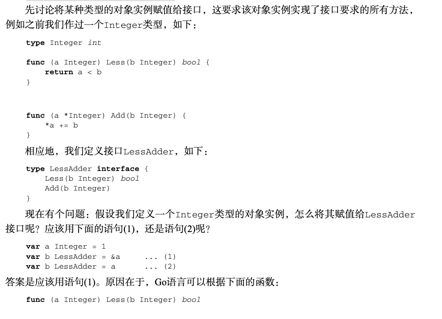
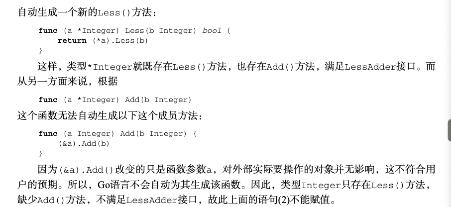
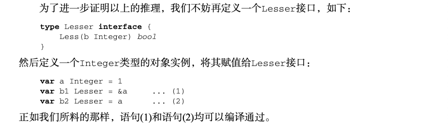

## 1 类型系统

顾名思义，类型系统是指一个语言的类型体系结构。一个典型的类型系统通常包含如下基本内容：

- 基础类型，如byte、int、bool、float等;
- 复合类型，如数组、结构体、指针等;
- 可以指向任意对象的类型(Any类型);
- 值语义和引用语义;
- 面向对象，即所有具备面向对象特征(比如成员方法)的类型;
- 接口。

### 1.1 为类型添加方法

在Go语言中，你可以给任意类型(包括内置类型，但不包括指针类型)添加相应的方法， 例如

```go
type Integer int

func (a Integer) Less(b Integer) bool {
  return a < b
}
```

Integer和int没有本质不同，只是新增了一个方法

```go
func main() {
  var a Integer = 1
  if a.Less(2) {
    fmt.Println(a,"Less 2")
  }
}
```

面向对象和面向过程对比

```go
func (a Integer) Less(b Integer) bool { // 面向对象 
  	return a < b
}
func Integer_Less(a Integer, b Integer) bool { // 面向过程 
 	 return a < b
}

a.Less(2) // 面向对象的用法
Integer_Less(a, 2) // 面向过程的用法
```

Go语言中的面向对象最为直观，也无需支付额外的成本。如果要求对象必须以指针传递， 这有时会是个额外成本，因为对象有时很小(比如4字节)，用指针传递并不划算。

只有在需**要修改对象的时候，才必须用指针**。它不是Go语言的约束，而是一种自然约束。 举个例子:

```go
func (a *Integer) Add(b Integer) {
  *a += b
}
```

使用

```go
func main() {
  var a Integer = 1
  a.Add(2)
  fmt.Println("a=",a)
}
```

### 1.2 值语义和引用语义

值语义和引用语义的差别在于赋值，比如下面的例子:

```go
b=a 
b.Modify()
```

如果b的修改不会影响a的值，那么此类型属于值类型。如果会影响a的值，那么此类型是引用类型。

Go语言中的大多数类型都基于值语义，包括:

- 基本类型：byte, int, bool, float32, string 等
- 复合类型：数组，结构体，指针

```go
//值类型 内容复制
var a = [3]int{1, 2, 3} 
var b = a
b[1]++
fmt.Println(a, b)
---------------------

[1 2 3] [1 3 3]
```

```go
//值类型 内容复制
//这表明b=&a赋值语句是数组内容的引用
var a = [3]int{1, 2, 3} 
var b = &a  //b的类型 *[3]int
b[1]++
fmt.Println(a, b)
---------------------

[1 3 3] [1 3 3]
```

Go语言中有4个类型比较特别，看起来像引用类型，如下所示：

- 数组切片:  指向数组(array)的一个区间。

  ```go
  type slice struct {
      first *T
  		len int
  		cap int 
  }
  ```

- map:  极其常见的数据结构，提供键值查询能力。

  ```go
  //map本质上是一个字典指针，你可以大致将map[K]V表示为
  type Map_K_V struct { 
    // ...
  }
  type map[K]V struct {
    imp1 *Map_K_V
  }
  ```

- channel: 执行体(goroutine)间的通信设施。

- 接口(interface):  对一组满足某个契约的类型的抽象。

## 2 struct

Go语言的结构体(struct)和其他语言的类(class)有同等的地位，但Go语言放弃了包括继 承在内的大量面向对象特性，只保留了组合(composition)这个最基础的特性。

例子：

```go
type Rect struct {
  x, y float64
  width, height float64
}

func (r *Rect) Area() float64{
  return r.width * r.height
}
```

### 2.1 实例化struct

```go
rect1 := new(Rect)
rect2 := &Rect{}
rect3 := &Rect{0,0,100,200}
rect4 := &Rect{width:100,height:200}
```

在Go语言中，未进行显式初始化的变量都会被初始化为该类型的零值，例如bool类型的零 值为false，int类型的零值为0，string类型的零值为空字符串。

在Go语言中没有构造函数的概念，对象的创建通常交由一个全局的创建函数来完成，以 NewXXX来命名，表示“构造函数”:

```go
func NewRect(x, y, width, height float64) *Rect { 
  return &Rect{x, y, width, height}
}
```

### 2.2 匿名组合

Go语言也提供了继承，但是采用了组合的文法，所以我们将其称为匿名组合：

```go
type Base struct {
  	Name string
}

func (base *Base) Foo() {...}
func (base *Base) Bar() {...}


type Foo struct {
  	Base
  	...
}
func (foo *Foo) Bar() {
  foo.Base.Bar()
}
```

以上代码定义了一个Base类(实现了Foo()和Bar()两个成员方法)，然后定义了一个 Foo类，该类从Base类“继承”并改写了Bar()方法(该方法实现时先调用了基类的Bar() 方法)。

在“派生类”Foo没有改写“基类”Base的成员方法时，相应的方法就被“继承”，例如在 上面的例子中，调用`foo.Foo()`和调用`foo.Base.Foo()`效果一致。


```go
//这段Go代码仍然有“派生”的效果，只是Foo创建实例的时候，需要外部提供一个Base类 实例的指针。
type Foo struct { 
  	*Base
		... 
}
```

### 2.3 可见性

Go语言对关键字的增加非常吝啬，其中没有private、protected、public这样的关键 字。要使某个符号对其他包(package)可见(即可以访问)，需要将该符号定义为以大写字母开头。

小写字母的只能在同一个package内访问

## 3 接口

### 3.1 其他语言的接口

Go语言的接口并不是其他语言(C++、Java、C#等)中所提供的接口概念。

在Go语言出现之前，接口主要作为不同组件之间的契约存在。对契约的实现是强制的，你 必须声明你的确实现了该接口。为了实现一个接口，你需要从该接口继承。

所以被称为侵入式接口

### 3.2 Go接口：非侵入式接口

在Go语言中，一个类只需要实现了接口要求的所有函数，我们就说这个类实现了该接口

```go
type File Struct {
  // ...
}

func (f *File) Read(buf []byte) (n int, err error)
func (f *File) Write(buf []byte) (n int, err error)
func (f *File) Seek(off int64, whence int) (pos int64, err error) 
func (f *File) Close() error
```

接口：

```go
type IFile interface {
		Read(buf []byte) (n int, err error)
		Write(buf []byte) (n int, err error)
		Seek(off int64, whence int) (pos int64, err error) 
  	Close() error
}

type IReader interface {
		Read(buf []byte) (n int, err error)
}

type IWriter interface {
		Write(buf []byte) (n int, err error)
}

type ICloser interface { 
  	Close() error
}
```

尽管File类并没有从这些接口继承，甚至可以不知道这些接口的存在，但是File类实现了这些接口，可以进行赋值：

```go
var file1 IFile = new(File) 
var file2 IReader = new(File) 
var file3 IWriter = new(File) 
var file4 ICloser = new(File)
```

### 3.3 接口赋值

接口赋值在Go语言中分为如下两种情况: 

- 将对象实例赋值给接口;
- 将一个接口赋值给另一个接口。

**例子1:**







**例子2:**




接口赋值给另一个接口

**例子3:**

```go
package one
type ReadWriter interface {
		Read(buf []byte) (n int, err error) 
  	Write(buf []byte) (n int, err error)
}
```

```go
package two
type IStream interface {
		Write(buf []byte) (n int, err error) 
 		Read(buf []byte) (n int, err error)
}
```

这里我们定义了两个接口，一个叫`one.ReadWriter`，一个叫`two.Istream`，两者都定义 了`Read()`、`Write()`方法，只是定义次序相反。`one.ReadWriter`先定义了`Read()`再定义了 `Write()`，而`two.IStream`反之。

在Go语言中，这两个接口实际上并无区别，因为:

- 任何实现了one.ReadWriter接口的类，均实现了two.IStream;
- 任何one.ReadWriter接口对象可赋值给two.IStream，反之亦然; 
- 在任何地方使用one.ReadWriter接口与使用two.IStream并无差异。

```go
//以下这些代码可编译通过:

var file1 two.IStream = new(File) 
var file2 one.ReadWriter = file1 
var file3 two.IStream = file2
```

### 3.4 接口查询

```go
//小接口
type Writer interface{
  	Write(buf []byte) (n int, err error) 
}

package two
//大接口
type IStream interface {
		Write(buf []byte) (n int, err error) 
 		Read(buf []byte) (n int, err error)
}
```

小接口转换为大接口

```go
var file1 Writer = ...
if file5,ok := file1.(two.IStream); ok {
		//这个if语句检查file1接口指向的对象实例是否实现了two.IStream接口，如果实现了，则执行特定的代码
  	...
}
```

### 3.5 类型查询

在Go语言中，还可以更加直截了当地询问接口指向的对象实例的类型，例如:

```go
var v1 interface{} = ...
switch v := v1.(type) {
  case int:     //现在v类型是int
 	 case string:  //现在v类型是string
}
```

### 3.6 接口组合

```go
// ReadWriter接口将基本的Read和Write方法组合起来 
type ReadWriter interface {
		Reader
		Writer 
}

type ReadWriter interface {
		Read(p []byte) (n int, err error) 
  	Write(p []byte) (n int, err error)
}
```

